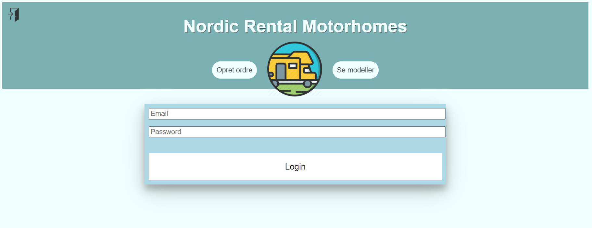

# NORDIC MOTORHOME RENTAL PROJECT

## User interface to handle orders, see available motorhomes and view your fleet
#### Nordic Motorhome Rental needed a website - a way to expand with their growing clientele
#### Written with JavaScript, Java, HTML, CSS, Thymeleaf and SQL
* preparedstatement
* establishing database connection
* exceptions
* error- and errorcode-handling

#### To set up the database you'll need a MySQL database - like MySQL Workbench - and create a new connection with the following information:

* Hostname: den1.mysql1.gear.host
* Username: motorhomeexam
* Password: myntepanic!

## Code samples
```javascript
/*AUTOFILL CUSTOMER INFORMATION BASED ON EXISTING E-MAIL*/
function autofillCustomer(){
        let element = document.getElementById("input-existing");
        let form = document.forms["create-customer-form"];
        element.addEventListener("keyup", function (event) {
            /*<![CDATA[*/
            let customers = /*[[${customers}]]*/ 'default';
            for (let i = 0; i < customers.length; i++) {
                if(element.value.toLowerCase() === customers[i].email.toLowerCase()){
                    setValues(customers[i], form);
                    setBackground(customerDb, "rgb(152,251,152,0.5)");
                } else {
                    removeValues(form);
                    setBackground(customerDb, "#FFFFFF");
                }
            }
            /*]]>*/
        })
    }
```

```java
//ERRORHANDLING W/ ERRORCONTROLLER AND SPECIFIC HTML PAGED FOR SPECIFIC ERROR CODES
@RequestMapping("/error")
    public String error(HttpServletRequest request) {
        Object status = request.getAttribute(RequestDispatcher.ERROR_STATUS_CODE);

        if (status != null) {
            int statusCode = Integer.parseInt(status.toString());

            if(statusCode == HttpStatus.NOT_FOUND.value()) {
                return "error-404";
            } else if(statusCode == HttpStatus.INTERNAL_SERVER_ERROR.value()) {
                return "error-500";
            } else if(statusCode == HttpStatus.BAD_REQUEST.value()){
                return "error-400";
            }
        }
        return "error-500";
    }

    @Override
    public String getErrorPath() {
        return "/error";
    }
```

```html
//HTML SITE TO ADD EXTRAS IN THE ORDER
<table>
    <tr th:each="extra : ${extras}">
        <td><input type="checkbox" id="extras" name="extras" th:id="check" th:value="${extra.id}">
        <label for="extras" th:text="${extra.description}"></label></td>
    </tr>

</table>
```
